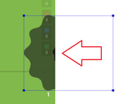
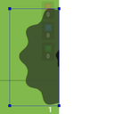

[](https://www.gnu.org/licenses/gpl-3.0)
# Intro
This little tool is build to manage data sets for learning. It currently supports COCO style annotation and its tested with some of my YOLO projects that you can find here: [RPANet](https://github.com/KevinUTAT/RPANet), [Surviver.IO](https://github.com/KevinUTAT/surviver_dot_IO) \
The focus of this tool is *active learning*, by providing simple work flow of editing existing annotations that maybe generated through active learning. \
The current build supports loading a existing datasets with images and labels and allows you to edit, delete and add new annotations.\
The tools is light weight and build with Python and PySide2 framework.
## Approach
This program treats your data cautiously. \
All your changes are saved in a data structure as changes, this allows two things:
- You can undo you modification with ease. It just have to remove an entry in the data structure.
- Your changes will not write to your labels only if you explicitly do so. 
# Change log
### 2021-03-27
- To address the problem with have bounding box (BBox) outside of the image:
  1. You can no longer create a BBox starting outside of the image now
  2. You can, still drag a BBox to outside of the image, but it will be moved to the nearest border. This make marking target on the edge easier:\
    >>> 
  3. To verify your existing labels not have anything out-of-range, *Tool -> Check labels* will also check that for you
### 2021-03-05
- Task system will accept a yaml file for class names.
- Re-do interface for editing target class. Now use a drop down menu if a ymal file is loaded.
- Now you can set a default class. Simplify steps when only added one class to data set
- Fix a bug when working with outside labels, newline are not added to the end
- Add label integrity checker to look for bad label due to the bug above
### 2021-02-07
- Task system are functioning in a bare bone manner.
- Now task will track all of finished data so you can pick up later
- Data background turn grey if its "finished"
### 2021-01-30
- Introducing Task system. A task is annotation flow that keep track of you progress as well.
- Add the new task window to generating a new Task
### 2021-01-10
- Create this repo and move the tool form [Surviver.IO](https://github.com/KevinUTAT/surviver_dot_IO).
- Small changes to make the tool independent, including disabling generating active data from video.
# How to run
First install python >= 3.8 or Anaconda and install dependency in requirements.txt
```
conda create --name <envname> --file requirements.txt
```
If ypu don't want to use conda, you need to modify requirements.txt to match ```pip install```. \
Once dependencies are installed, run the tool:
```
python activeDS.py
```
# How to start
## Work with a data folder
You will need a folder with your data organized as follow:
```
You_data_folder_
                |_ images _
                           |_ data_image_01.png
                           |_ data_image_02.png
                           |_ ... ...
                |_ labels _
                           |_ data_image_01.txt
                           |_ data_image_02.txt
                           |_ ... ...
```
Go to *Load* -> *Active learning output* to load such folder. You label are expected to be in COCO format:
```
<class number>, <center X>, <center Y>, <width>, <height>
... ...
```
## Work with a task
You can open a existing task by open the JSON task file by *Task* -> *Open* \
Or start a new task using the new task wizard: *Task* -> *New* \
When in task, opening a data will automatically mark it as *finished* and the data background turns grey. Double click a data to mark it as *unfinished* 
### yaml file
The program expect a yaml file in YOLO format. Class names are expected to organized like:
```yml
name: ['name0', 'name1', ... ]
```
# Know problems
- In some file/directory dialogs, not selecting anything might cause error, but nothing show stopper yet
- If click the viewer when there is no image loaded, error is thrawed, nothing show stopper.
- Opening a new folder/task after working on a different task can cause errors. For now always restart the program if you are to open a new folder/task
- ~~Label out of range. It is possible to label an image with bbox that is out of the size of the image.~~
- ~~A combination of actions can cause a bbox to be created twice~~
- An error with error msg of "C++ object (Ancker) already deleted":
  - In some rear cases, resizing a BBox resulting the old BBox not being removed, this seems to only be a drawing issue, not effecting the underline labeling logic.
  - ~~Right click errors.~~
- **PLEASE let me know if you found any problem with the program**